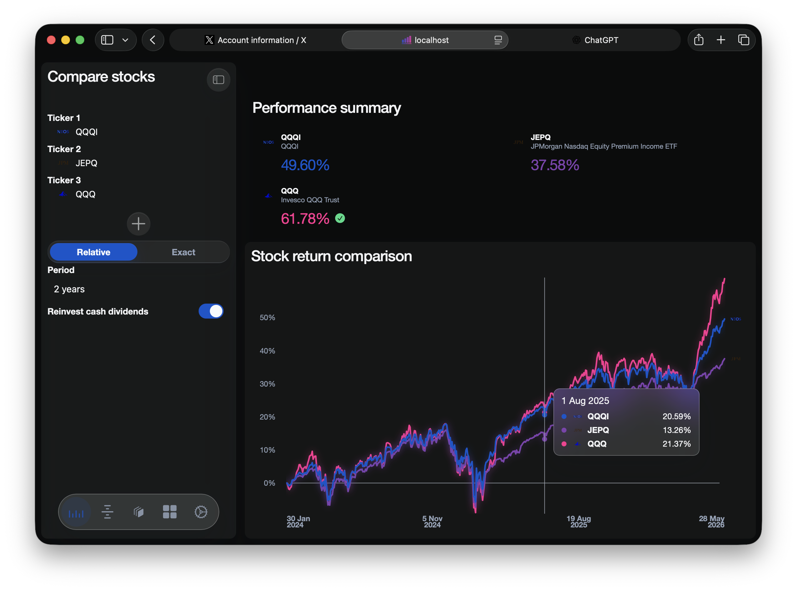

# antigravity

Documentation version: `v3.0.0`

`antigravity` is a local-first Flask web app for comparing US stock tickers, building weighted portfolios, running single-ticker strategy backtests, reviewing TradingView timing signals, and inspecting locally imported investment records from a server-rendered workspace backed by on-disk caches.

## Screenshot



## What the app does

- Compare up to 5 tickers over the same window on a normalized return basis
- Build weighted portfolios with custom allocations
- Run single-ticker backtests across the built-in strategy library
- Switch between relative periods and exact date ranges
- Include or exclude cash dividends in comparison, portfolio, and backtest calculations
- Use `1d` data by default and run `1m` backtests when local intraday data exists for the selected ticker
- Choose the backtest execution mode between `signal_close` and `next_open`
- Review TradingView-based timing signals from `More`
- Import IBKR CSV exports into a local investment ledger used by `More -> Investment`
- Manage theme, date format, broker access, Outlook SMTP OAuth, local cache maintenance, strategy metadata, and design tokens from `Settings`

## Runtime requirements

- Python `3.13`
- Dependencies from `requirements.txt`
- `pyarrow` for parquet persistence
- Optional Longbridge credentials for broker-backed market data and the preferred `1m` refresh path
- Optional `tradingview_ta` if you want TradingView timing analysis
- Optional Microsoft Entra app credentials if you want Outlook SMTP OAuth

This repository uses the host machine's Python interpreter directly. The helper scripts pin Python `3.13` so shell-level defaults such as Python `3.14` do not affect the project.

## Quick start

Install dependencies into the pinned host interpreter:

```bash
./scripts/setup_python.sh
```

By default, the setup script uses:

```text
/Library/Frameworks/Python.framework/Versions/3.13/bin/python3
```

If your Python `3.13` executable lives elsewhere, override it explicitly:

```bash
ANTIGRAVITY_PYTHON=/absolute/path/to/python3.13 ./scripts/setup_python.sh
```

Run the app:

```bash
./scripts/run_app.sh
```

The default server bind is:

```text
0.0.0.0:8688
```

Open `http://127.0.0.1:8688` in your browser. Host and port are configured in `config.toml`.

## Architecture at a glance

The runtime entry chain is:

```text
main.py
  -> app.create_app()
  -> app/web/routes_entry.py
  -> app/web/routes/{compare,portfolio,backtest,more,settings}.py
```

There is no Node.js build step, Docker setup, or alternate app runner in this repository. The supported local workflow is the pinned Python shell-script flow under `scripts/`.

## Workspace map

- `Compare`
  Compare up to 5 tickers with optional cash dividend inclusion.
- `Portfolio`
  Build weighted portfolios and inspect allocation plus aggregate return.
- `Backtest`
  Run a single-ticker strategy backtest with configurable capital, interval, dividends, and strategy parameters.
- `More`
  Inspect the `Timing` and `Investment` views.
- `Settings`
  Review app metadata, appearance and date preferences, backtest execution mode, design tokens, service health, broker access, Outlook SMTP OAuth, Local Market Store maintenance, strategy metadata, and cache controls.

## Settings navigation

The current `Settings` navigation includes:

- `About`
- `General`
- `Backtest`
- `Font tokens`
- `Material tokens`
- `Style tokens`
- `Network self-check`
- `Broker access`
- `Email (SMTP)`
- `Local market store`
- `Strategies`
- `Clear caches`

## Data sources and local storage

### Daily history

- Stored in `market_store/historical/` as parquet
- Used by comparison views, portfolio views, investment valuation, and default backtests
- Downloaded through `yfinance` first
- Falls back to Longbridge when `yfinance` fails and valid Longbridge credentials are configured

### 1-minute history

- Stored in `market_store/historical/` as parquet
- Preferred source is Longbridge
- Refresh can fall back to recent `yfinance` windows when Longbridge is unavailable
- Persisted data is trimmed to the latest 6 months of trading days
- Used when local `1m` data exists for the selected ticker

### Metadata and search caches

- `market_store/profiles/profiles.parquet` stores cached company profiles
- `market_store/logos/` stores cached ticker logos
- `market_store/search/search_cache.parquet` stores search-result caches
- `market_store/search/ticker_usage.json` stores ticker usage frequency
- `market_store/search/strategy_usage.json` stores strategy usage frequency

### Runtime-only local settings

`settings_store/` is created locally at runtime and is ignored by Git. It is used for device-local data such as:

- `settings_store/brokers.json`
- `settings_store/smtp.json`
- `settings_store/date_display.json`
- `settings_store/investment.json`

## Investment ledger notes

- Investment transactions are read from `settings_store/investment.json`
- The `More -> Investment` workspace renders holdings, equity history, metrics, and transaction history from that ledger
- Holdings reuse locally cached ticker profiles and logos when available
- Configured money market funds can use the transaction `description` field as a display-name fallback when no local profile exists
- IBKR internal FX conversion symbols such as `USD.HKD` are treated as ledger-only cash-conversion artifacts rather than queryable securities

`config.toml` contains an `investment.money_market_funds` rule family for cash-like instruments whose valuation should not depend on normal daily mark-to-market history.

## Broker and email support

### Longbridge

- Used for broker-backed market data
- Preferred source for `1m` history refresh
- Can also serve as the fallback source for `1d` history
- Requires App Key, App Secret, and Access Token

### IBKR

- The UI exposes IBKR configuration status
- Historical `1m` fetching is not implemented yet
- IBKR CSV imports are supported for rebuilding the local investment ledger

### Outlook SMTP

- Uses `smtp-mail.outlook.com:587` with `STARTTLS`
- Uses Microsoft OAuth `2.0` rather than password-first SMTP auth
- Supports device-code authorization
- Expects a Microsoft Entra app client ID and the delegated scope `https://outlook.office.com/SMTP.Send`

## Strategy system

- Strategy implementations live under `strategies/algorithms/`
- Runtime strategy discovery is dynamic and is handled by `strategies/loader.py`
- `strategies/registry.json` is retained only as a deprecated migration marker and is not the runtime source of truth
- Backtest execution logic lives in `strategies/backtest.py`

## Project layout

```text
main.py                         -> Flask runtime entry point
config.toml                     -> App metadata, defaults, server bind, labels, and integration settings
README.md                       -> Project documentation
requirements.txt                -> Python dependency pin set
scripts/setup_python.sh         -> Pinned host-Python dependency installer
scripts/run_app.sh              -> Pinned host-Python app launcher
scripts/test.sh                 -> Pinned host-Python pytest wrapper
app/core/                       -> Shared config and persisted settings helpers
app/infrastructure/             -> Storage, connectivity, and broker market-data integration
app/services/                   -> Business logic for comparisons, market data, investment import, and presentation
app/web/routes/                 -> Flask route registration by workspace
app/web/runtime.py              -> Web runtime assembly and request handling
app/web/templates/              -> Server-rendered HTML templates
app/web/static/                 -> CSS, JavaScript, and image assets
strategies/                     -> Strategy framework, loader, backtest engine, and algorithms
market_store/                   -> Local parquet, profile, logo, and search caches
settings_store/                 -> Runtime-generated local settings and investment ledger files
```

## Versioning note

The version displayed in the web UI comes from `config.toml` under `[app].version`. Some Python files also contain file-level `Code version:` comments; those are source-file revision markers, not the app metadata shown in the interface.

## Running tests

Run pytest through the pinned host interpreter:

```bash
./scripts/test.sh
```

You can also pass normal `pytest` arguments through the wrapper:

```bash
./scripts/test.sh -q
```

At the time of writing, the repository does not include a committed `tests/` directory because that path is ignored by `.gitignore`. The wrapper is still useful for local or untracked tests you add in your own workspace.
